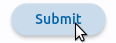

Exercise Flutter : 
User Groups in ACS app
===


---

The problem
===

Program this: https://github.com/disseny-de-software/exercise_flutter_acs_slides/blob/main/README.md

---

Program in Flutter the user interface of the ACS app to manage the groups of users :

1. list existing groups
1. for a group show *and edit*
    1. name and description
    1. schedule = from and to dates and times, weekdays
    1. allowed actions
    1. list of users
    1. *not* the allowed areas (button ) for the moment
1. show user data (name + credential) and edit them
1. add a new group (but not delete)
1. add a new user of a group (but not delete)

---

8 Screens + drawer
===

    

---

    

---

Code provided [here](https://github.com/disseny-de-software/exercici_flutter_acs_students)
===

[``data.dart``](https://github.com/disseny-de-software/exercise_flutter_acs/src/data.dart)
 
The data of the admin, managers and employees is in Flutter, no webserver here.

- data are stored in objects of the corresponding classes: ``Group`` class with a ``Schedule``, a list of allowed ``Action`` and list of ``User``


- all data are in a ``Data`` class, in ``static`` attributes so that they are a kind of global variables you can access just importing ``data.dart``

- plus the default values to be shown in the interface when creating a new user group.

---

[``main.dart``](https://github.com/disseny-de-software/exercise_flutter_acs/src/main.dart)

The entry point of the app. As always, sets the ``ThemeData`` which means the ``ColorScheme`` and ``TextTheme``.

``ColorScheme`` means a color palette chosen around a main color (here ``Colors.blue``), defining a primary/secondary/tertiary color, backgrounds, colors on top of primary etc. This determines the colors of the app bar, buttons, text etc.

```dart
appBar: AppBar(
  backgroundColor: Theme.of(context).colorScheme.primary, // blue
  foregroundColor: Theme.of(context).colorScheme.onPrimary, // white
  title: Text("ACS"),
),
```

    

Read this https://docs.flutter.dev/cookbook/design/themes

---


[``screen_blank.dart``](https://github.com/disseny-de-software/exercise_flutter_acs/src/screen_blank.dart)

- No content, first screen shown when executing.
- Just want it to open the drawer and go to list of groups
- Scaffold ( Drawer, AppBar ), no ``body``

 
---


[``drawer.dart``](https://github.com/disseny-de-software/exercise_flutter_acs/src/screen_blank.dart)

Defines class ``TheDrawer`` with attribute ``drawer``,  an instance of Flutter ``Drawer``. This is because several screens have this same drawer.

Next screen :
```dart
onTap: () {
    Navigator.of(context).pop(); // close drawer
    Navigator.of(context).push(MaterialPageRoute<void>(
      builder: (context) => 
        ScreenListGroups(userGroups: Data.userGroups),
    )); // go to screen of list of groups

},
```
 
Guidelines to make a drawer https://flutter.dev/docs/cookbook/design/drawer

---


[``screen_list_groups.dart``](https://github.com/disseny-de-software/exercise_flutter_acs/src/screen_list_groups.dart)

- ``ScreenListGroups`` receives ``userGroups`` from ``TheDrawer``:
  ```dart
  class ScreenListGroups extends StatefulWidget {
    List<UserGroup> userGroups;

    ScreenListGroups({super.key, 
      required this.userGroups});
  ```
  
- so that its state can have access to it to show its names and number of users:
  ```dart
  class _ScreenListGroupsState 
    extends State<ScreenListGroups> {
    late List<UserGroup> userGroups;

    @override
    void initState() {
      super.initState();
      userGroups = widget.userGroups; // of ScreenListGroups
    }
  ```


---

TODO
===

We provide you the former 5 files, you don't need to change them except for ``screen_list_groups.dart`` where you have to implement ``onTap()`` of ``_buildRow()`` in order to go to the group screen, to start showing the $i$-th group in the list.

---

Hint:

```dart
Widget _buildRow(UserGroup userGroup, int index) {
  return ListTile(
      title: Text(userGroup.name),
      trailing: Text('${userGroup.users.length}'),
      onTap: () => Navigator.of(context)
          .push(MaterialPageRoute<void>(
                  builder: (context) => ScreenGroup(userGroup: userGroup)),
                )
          .then((var v) => setState(() {})),
  );
}
```

Why ``.then`` ? When we come back from ``ScreenGroup`` where maybe we have changed the group name or added users, we want to show the new name and present number of users.


---


```dart
Scaffold
  appBar: AppBar
  body: Center(
    child: Gridview.count(
      children: [
        Container(
          child: Center(
            child: Column(
              children: [
                IconButton(icon: Icon),
                Text,]
```

See [IconButton](https://api.flutter.dev/flutter/material/IconButton-class.html), [Column](https://api.flutter.dev/flutter/widgets/Column-class.html), [Gridview](https://api.flutter.dev/flutter/material/Card-class.html) and Material's [catalog of icons](https://material.io/resources/icons) (can be different)

---


```dart
Scaffold(
  appBar: AppBar
  body: Form(
    child: Container(
      child: Column(
        children: [
          TextFormField,
          TextFormField,
          Padding(
            child: ElevatedButton(
              child: Text
```

See ``Form`` [validation](https://docs.flutter.dev/cookbook/forms/validation) and how to [retrieve](https://docs.flutter.dev/cookbook/forms/retrieve-input) the value of a text field

To show a "saved" message after submit:

```dart
ScaffoldMessenger.of(context)
  .showSnackBar(
    const SnackBar(content: Text('Saved')),
);
```

---


```
Scaffold(
  appBar: AppBar
  body: Container(
    child: Column(
      children: [
        Row(
          children: [
            Container(child: Text),
            Text,
            IconButton(icon: Icon)
          ]),
        Row like above
        Column:
          children: [
            Text,
            WeekDaySelector
        ]),
        Row like above,
        Row like above
        Padding(
          child: ElevatedButton(
            child: Text
```

---

### Time and date classes

- [``DateTime``](https://api.flutter.dev/flutter/material/TimeOfDay-class.html)
  - constructors ``DateTime.now()`` ``DateTime(2023)``, 
  ``DateTime(2023, 9, 7, 17, 30)`` Sept. 7 2023, 17:30
  - weekdays ``DateTime.monday`` ... ``DateTime.sunday`` (ints)
  - boolean method ``dt1.isAfter(dt2)``

- [``TimeOfDay``](https://api.flutter.dev/flutter/material/TimeOfDay-class.html)
  - constructor ``TimeOfDay(hour: 08, minute: 00)``
  - accessors ``tod.hour``, ``tod.minute`` 
  - no ``isAfter()``, make a pair of ``DateTime`` with their hour and minute

---

### Date formatting and week day selector widget

Install ``intl`` (internationalization) library and [weekday_selector](https://pub.dev/packages/weekday_selector) packages to get ``DateFormater`` and ``WeekDaySelector`` classes. In ``pubspec.yaml`` add dependencies :

```yaml
dependencies:
  intl: ^0.18.1
  weekday_selector: ^1.1.0
```

```dart
final DateFormat _dateFormatter = DateFormat.yMd(); 
Text(_dateFormatter.format(someDateTime));
// displays Sept 1st 2023 as 9/1/2023
```


``WeekDaySelector`` is highly customizable
 


---

### Hint: how to make a date picker to appear

```dart
late DateTime now;
late DateTime startDate;
// initialized in _initState()
//...
_pickStartDate() async {
  DateTime? newStartDate = await showDatePicker(
    context: context,
    firstDate: DateTime(now.year),
    lastDate: DateTime(now.year + 5),
    initialDate: now,
  );
  startDate = newStartDate!;
  setState(() {}); // to update the text field
}
```

Similarly, make also a ``_pickStartTime()``

See [DatePicker](https://api.flutter.dev/flutter/material/showDatePicker.html) and [TimePicker](https://api.flutter.dev/flutter/material/showTimePicker.html)


---

### Hint: how to show an error message


```dart
_showAlert(String title, String message) {
  showDialog<void>(
    context: context,
    barrierDismissible: false, // user must tap button!
    builder: (BuildContext context) {
      return AlertDialog(
        title: Text(title),
        content: SingleChildScrollView(
          child: ListBody(
            children: <Widget>[Text(message),],
          ),
        ),
        actions: <Widget>[
          TextButton(
            child: const Text('Accept'),
            onPressed: () {
              Navigator.of(context).pop();
            },
          ),
        ],
      );
    },
  );
}
```

---


```dart
Scaffold(
  appBar: AppBar
  body: Column(
    children: <Widget>[
      CheckBoxListTile(
        title: Text
        subtitle: Text)
      Divider
      # repeat 4 more times
      Padding(
        child: ElevatedButton(
          child: Text
```

See [CheckBoxListTile](https://api.flutter.dev/flutter/material/CheckboxListTile-class.html)

---


Similar to ``screen_list_groups.dart`` we already provide.

---


Similar to the screen with a group info. 

---

Grading
===

- 1/3 of total points if screen group (slide 13), group info (14), actions (20)

- 2/3 total points if previous item plus schedule (15)

- all the points if previous item plus list of users (21) and user info (22)

In all the cases, it is desirable to implement persistence across screens (input/changes is really done on the data and shown) but not mandatory.

FAB button to add a new user has to be implemented and it must appear later in the list of users.

---

Deliverables
===

A zip file, named ``exercici_flutter.zip`` with the following content :

1. The text file with the NIU and names of the authors.
1. If you have done the exercise with IntelliJ, directory ``lib`` plus ``pubspec.yaml``. If you have done it with dartpad.dev then the single dart source file, runnable in dartpad.
3. Some screen captures showing how it works
4. A pdf file explaining the changes requested by the instructor during the assessment and proof of having done them.


