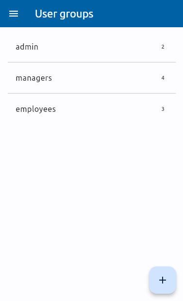

<!-- https://github.com/orgs/marp-team/discussions/533 -->
<style>
  section {
    align-content: unsafe center;
  }
</style>

Let's start the exercise
===
<br>

Precondition: have installed Flutter in your laptop, that is
- Flutter itself, see https://docs.flutter.dev/install/manual
- for some target, web target is the easiest to install, see https://docs.flutter.dev/platform-integration/web/setup
- Flutter plugin for IntelliJ, https://docs.flutter.dev/tools/android-studio

This covers both Windows and Linux.
<br>
If not, you can try to proceed with https://dartpad.dev, no installation required.

---

1. Download source code files from [here](https://github.com/disseny-de-software/exercici_flutter_acs_students/tree/master/lib)


2. If *IntelliJ*
   - make a new Flutter project
   - move the 5 dart files to ``lib/`` (overwrite ``main.dart``)

   If *dartpad*
   - copy the code of 5 file files into the editor window
   - remove all the import sentences except
    ``import 'package:flutter/material.dart'``
<br>   

3. Run and check it works

---

We'll start with the easiest screen: the **list of users of a group**, because except for the content, it's the same as the list of groups

$\hspace{1cm}$  $\hspace{.5cm}\rightarrow\hspace{.5cm}$ 

---

1. make a new Dart file named ``screen_list_users.dart``
<br>
2. copy the content or ``screen_list_groups.dart`` into it

    (in dartpad copy-paste the classes ``ScreenListGroups`` and ``_ScreenListGroupsState``)
<br>
3. replace in the pasted code
      - ``ScreenListGroups`` $\rightarrow$ ``ScreenListUsers``
      - ``_ScreenListGroupsState``  $\rightarrow$ ``_ScreenListUsersState``
      - ``List<UserGroup> userGroups`` $\rightarrow$ ``UserGroup userGroup``

---

4. change ``title`` argument of ``AppBar`` from ``"User groups"`` to the name of the present user group, ``"Users ${userGroup!.name}"``, with ``!`` because of ``late userGroup``
<br>
5. In ``ListView`` of ``body`` change ``itemCount`` to the number of users of the group, and first parameter of ``_buildRow`` to the user object at ``index`` position in the list
<br>
6. Update accordingly the method ``_buildRow()``, to display the name and credential of the user instead of name and number of users of a group

---

7. In ``onPressed()`` of ``FloatingActionButton`` add a new user to the list with name ``"new user"`` and credential ``"00000"``
<br>

Run (or hot reload) the program. Can you see the new screen ?

---

No, it's the same as before because we need still to add sentences to "navigate" from some screen to it. 
<br>
For the moment, let's do it when we click on one item of the list of groups, to show (of course) it's users.
<br>
In the final solution you reach to this screen from the one with the features of a group (with 5 grey squares)

---

8. Go to class ``_ScreenListGroupsState``. We have to change the parameter ``onTap`` of ``ListTile`` in method ``_buildRow()`` (bottom of file) from ``() {}`` to 
    ```dart
    () {
        Navigator.of(context).push(MaterialPageRoute<void>(
            builder: (context) =>
                ScreenListUsers(userGroup: userGroup)));
    }
    ```
    and add import of ``screen_list_users.dart``
    <br>

    Now the list of users should appear when we click on a group.

    But once on the screen of users, can we go back to the screen of groups ? why ?

---

No, because we have copy-pasted the parameter ``drawer`` of the ``Scaffold`` that makes the "hamburguer button"  to appear instead of the back button .

Just delete this argument and reload.

---

Continuation: when we click on the floating action button to add a new user, a new item in the list is added *instead* of navigating to a new screen, to enter name and credential (and photo) of the new user.

$\hspace{2cm}$  $\longrightarrow$ 


First, create the classes ``ScreenUser`` and ``_ScreenUserState`` in ``screen_user.dart`` and then navigate to it like we have done above.
